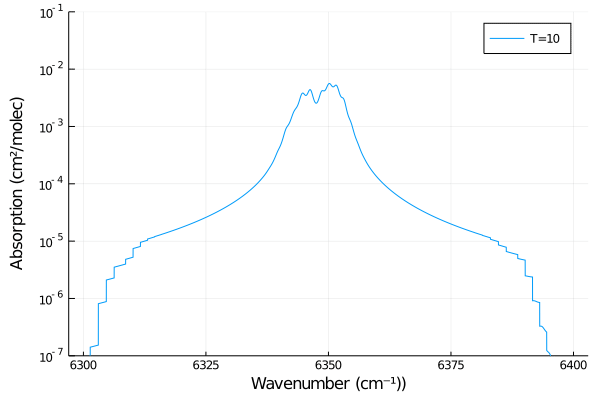
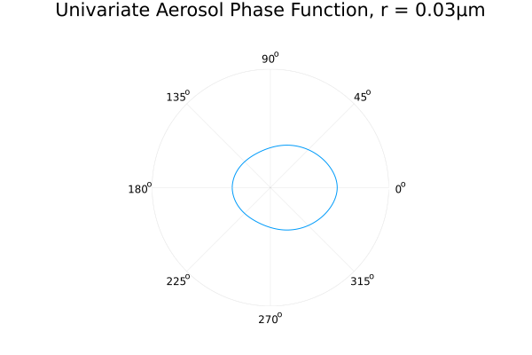

<h1 align="center">
  <br>
  <a href="https://github.com/RemoteSensingTools/vSmartMOM.jl"></a>
  <br>
  vSmartMOM.jl
  <br>
</h1>

<div align="center">
<h4 align="center">
  <strong>v</strong>ector <strong>s</strong>imulated <strong>m</strong>easurements of the <strong>a</strong>tmosphere
  using <strong>r</strong>adiative <strong>t</strong>ransfer based on the <strong>M</strong>atrix <strong>O</strong>perator <strong>M</strong>ethod
</h4>
<h4 align="center">An end-to-end modular software suite for vectorized atmospheric radiative transfer calculations, based on the Matrix Operator Method.</h4>
<h5 align="center">Written in <a href="https://julialang.org">Julia</a>.</h4>

[](https://github.com/RemoteSensingTools/vSmartMOM.jl/actions/workflows/AutomatedTests.yml/)
  [](https://RemoteSensingTools.github.io/vSmartMOM.jl/dev/)
  [](https://github.com/RemoteSensingTools/vSmartMOM.jl/blob/master/LICENSE)
  [](https://doi.org/10.21105/joss.04575)
  [](https://github.com/RemoteSensingTools/vSmartMOM.jl/commits/master)
  


<p align="center">
  <a href="#installation">Installation</a> •
  <a href="#modules">Modules</a> (<a href="#vsmartmom">vSmartMOM</a>, <a href="#vsmartmomabsorption">Absorption</a>, <a href="#vsmartmomscattering">Scattering</a>) •
  <a href="#support">Support</a> •
  <a href="#license">License</a>
</p>
</div>
This project aims to revamp and modernize key atmospheric remote sensing tools. Specifically, it will enable the fast computation of atmospheric optical properties, full-polarized radiative transfer simulations, and commonly-used inversion routines.

The core of the code is based on recent publications:

- Sanghavi, S., Davis, A. B., & Eldering, A. (2014). vSmartMOM: A vector matrix operator method-based radiative transfer model linearized with respect to aerosol properties. Journal of Quantitative Spectroscopy and Radiative Transfer, 133, 412-433. [Download](https://www.sciencedirect.com/science/article/pii/S0022407313003592)

- Sanghavi, S. V., Martonchik, J. V., Davis, A. B., & Diner, D. J. (2013). Linearization of a scalar matrix operator method radiative transfer model with respect to aerosol and surface properties. Journal of Quantitative Spectroscopy and Radiative Transfer, 116, 1-16. [Download](https://www.sciencedirect.com/science/article/pii/S0022407312004633)

- Sanghavi, S., & Natraj, V. (2013). Using analytic derivatives to assess the impact of phase function Fourier decomposition technique on the accuracy of a radiative transfer model. Journal of Quantitative Spectroscopy and Radiative Transfer, 119, 137-149. [Download](https://www.sciencedirect.com/science/article/pii/S0022407313000071)

- Sanghavi, S. (2014). Revisiting the Fourier expansion of Mie scattering matrices in generalized spherical functions. Journal of Quantitative Spectroscopy and Radiative Transfer, 136, 16-27. [Download](https://www.sciencedirect.com/science/article/pii/S0022407313004962)

By taking advantage of modern software tools, such as GPU acceleration and HPC computing, the software suite significantly accelerates computationally-intensive calculations and models, while keeping the interface easy-to-use for researchers and students.

## Installation

vSmartMOM can be installed using the Julia package manager. From the Julia REPL, type `]` to enter the Pkg REPL mode and run

```julia
pkg> add vSmartMOM
```

## Modules

**Note: This section provides only a quick overview of the available modules in vSmartMOM.jl.**

For in-depth examples, tutorials, and implementation details, please see the complete <a href="https://RemoteSensingTools.github.io/vSmartMOM.jl/dev/">Documentation</a>.


### vSmartMOM

The vSmartMOM module allows end-to-end simulation of radiative transfer (RT) throughout Earth's atmosphere and surface. Specifically, it:

  1. Enables 1D vectorized plane-parallel RT modeling based on the Matrix Operator Method.
  2. Incorporates fast, high fidelity simulations of scattering atmospheres containing haze and clouds – including pressure- and temperature-resolved absorption profiles of gaseous species in the atmosphere. 
  3. Enables GPU-accelerated computations of the resulting hyperspectral reflectances/transmittances.
  
  Key functions:

  - `parameters_from_yaml(filepath::String)`: Load a custom set of RT parameters from a YAML file.
  - `default_parameters()`: Load a default set of RT parameters.
  - `model_from_parameters(params::vSmartMOM_Parameters)`: Build an `RTModel` with all derived optical properties (cross-section profiles, scattering phase functions, etc.) ready for simulation.
  - `rt_run(model::RTModel)`: Perform forward RT simulation, returning reflectance and transmittance.
  - `model_from_parameters(LinMode(), params)`: Build both an `RTModel` and an `RTModelLin` for analytic Jacobian computation.
  - `rt_run(model, lin_model, NAer, NGas, NSurf)`: Linearized RT returning `(R, T, dR, dT)` with exact Jacobians.

#### Forward run (minimal)

```julia
using vSmartMOM
params = parameters_from_yaml("config/quickstart.yaml")  # any YAML config
model  = model_from_parameters(params)
R, T   = rt_run(model)                                    # reflectance, transmittance
```

#### Linearized run (analytic Jacobians)

```julia
using vSmartMOM
params = parameters_from_yaml("config/ocean_coxmunk.yaml")
model, lin_model = model_from_parameters(LinMode(), params)
NAer  = length(params.scattering_params.rt_aerosols)
NGas  = size(lin_model.tau_dot_abs[1], 1)
NSurf = 1
R, T, dR, dT = rt_run(model, lin_model, NAer, NGas, NSurf)
```

`dR` and `dT` carry the exact analytic derivatives of `R`, `T` w.r.t.
aerosol, gas, and surface parameters laid out via `ParameterLayout`.

### vSmartMOM.Absorption

This module enables absorption cross-section calculations of atmospheric gases at different pressures, temperatures, and broadeners (Doppler, Lorentzian, Voigt). It uses the <a href="https://hitran.org">HITRAN</a> energy transition database for calculations. While it enables lineshape calculations from scratch, it also allows users to create and save an interpolator object at specified wavelength, pressure, and temperature grids. It can perform these computations either on CPU or GPU. <br><br>

#### HITRAN Data Access

vSmartMOM provides two pathways for obtaining HITRAN spectroscopic data:

- **Legacy artifacts (default):** Pre-packaged HITRAN 2016 data, downloaded automatically on first use. No setup required.
- **Direct download from hitran.org:** Fetch the latest HITRAN edition (currently HITRAN 2024) with full provenance tracking (SHA-256 hash, download date, source URL).

```julia
# Default: HITRAN 2016 via artifacts
path = artifact("CO2")

# Switch to HITRAN 2024 from hitran.org
set_hitran_edition!("HITRAN2024")
path = artifact("CO2")  # auto-downloads on first call

# Check provenance
hitran_info("CO2")  # returns metadata dict with SHA-256, download date, etc.
```

See the full <a href="https://RemoteSensingTools.github.io/vSmartMOM.jl/dev/pages/Absorption/HITRAN_Data/">HITRAN Data Management</a> documentation for details on edition switching, custom wavenumber ranges, and cache management.

#### Key functions

  - `artifact(molecule::String)`: Retrieve the path to a HITRAN `.par` file for a molecule. Routes through legacy artifacts or hitran.org depending on the active edition.
  - `fetch_hitran(molecule; numin, numax, edition)`: Download HITRAN data directly from hitran.org with optional wavenumber filtering.
  - `read_hitran(filepath::String)`: Creates a HitranTable struct from a fixed-width HITRAN `.par` file.
  - `make_hitran_model(hitran::HitranTable, broadening::AbstractBroadeningFunction, ...)`: Create a HitranModel struct that holds all of the model parameters needed to perform an absorption cross-section calculation (transitions, broadening type, wing_cutoff, etc.)
  - `make_interpolation_model(hitran::HitranTable, broadening::AbstractBroadeningFunction, ...)`: Similar to creating a HitranModel, but this will perform the interpolation at the given wavelength, pressure, and temperature grids and store the interpolator in InterpolationModel.
  - `absorption_cross_section(model::AbstractCrossSectionModel, grid::AbstractRange{<:Real}, pressure::Real, temperature::Real, ...)`: Performs an absorption cross-section calculation with the given model (HitranModel or InterpolationModel), at a given wavelength grid, pressure and temperature

### vSmartMOM.Scattering

This module enables scattering phase-function calculation of atmospheric aerosols with different size distributions, incident wavelengths, and refractive indices. It can perform the calculation using either the Siewert NAI-2 or Domke PCW methods ([Suniti Sanghavi 2014](https://www.sciencedirect.com/science/article/pii/S0022407313004962)). <br><br><br> Key functions:

  - `make_univariate_aerosol(size_distribution::ContinuousUnivariateDistribution, r_max, nquad_radius::Int, nᵣ, nᵢ`: Create an aerosol object with size distribution and complex refractive index. 
  - `make_mie_model(computation_type::AbstractFourierDecompositionType, aerosol::AbstractAerosolType, λ::Real, polarization::AbstractPolarizationType, truncation_type::AbstractTruncationType, ...)`: Create a MieModel struct that holds all of the model parameters needed to perform a phase function calculation (computation type, aerosol, incident wavelength, etc. )
  - `compute_aerosol_optical_properties(model::MieModel)`: Compute the aerosol optical properties using the specified model parameters

## How to Contribute 

vSmartMOM.jl is a growing package and thus feedback from users like you are highly appreciated. To report bugs or suggest new features in vSmartMOM.jl, please create GitHub [Issues](https://github.com/RemoteSensingTools/vSmartMOM.jl/issues). To contribute to the package, please feel free to create a [Pull Request](https://github.com/RemoteSensingTools/vSmartMOM.jl/pulls). 

If you have any questions about the methods used or would like to chat with us, please feel free to shoot us an email <a href="mailto:suniti.sanghavi@gmail.com,cfranken@caltech.edu">here</a>. 

## Acknowledgements

This project is being developed at Caltech/JPL and largely based on work by Suniti Sanghavi from NASA/JPL, with initial support from the Schmidt Academy for Software Engineering (SASE) for the first refactor into Julia.

## Copyright Notice

Apache 2.0 License; Copyright 2022, by the California Institute of Technology. United States Government Sponsorship acknowledged.
