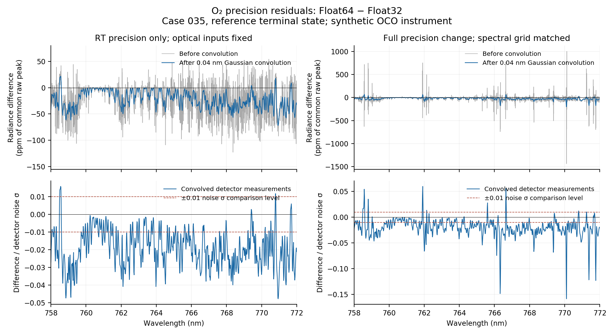

# Precision differences after instrument convolution

The noise-normalized radiance differences and Jacobian remainders in the
[precision investigation](precision_investigation.md) already refer to the
**convolved, detector-sampled measurement**, not the high-resolution RT output.
This additional audit makes that distinction explicit and checks the
instrument calculation separately. It uses both saved terminal states of O2
case 035, with Float64 as the internal precision control.

## Measurement operator and checks

The study's `SyntheticOCO2.process_stokes_spectrum` applies, in order:

1. The representative analyzer response `M11 I − M12 Q + M13 U`.
2. Spectral-density conversion from per cm⁻¹ to per nm.
3. A wavelength-space Gaussian with **0.04 nm FWHM**, including trapezoidal
   wavelength weights and normalized support through **±6 Gaussian σ**.
4. Evaluation at the **934 detector centers**, spaced **0.015 nm** apart.

This is the study's synthetic Gaussian instrument, not a measured OCO ILS.
Convolution and sampling are implemented as direct evaluation of the integral
at each requested center. The new audit also evaluates it at 4,666 centers,
with four additional centers between each detector pair, to inspect the
convolved spectrum between detector samples.

`verify_convolution.jl` reads the saved high-resolution Stokes arrays and the
live study's instrument/grid definitions. All **10 reconstructed measurement
arrays equal the earlier saved arrays exactly**. Every detector sample also
equals the corresponding dense-convolution output exactly. Constant spectra
are preserved, and convolution of each same-grid difference agrees with the
difference of the convolved spectra to floating-point accuracy.

An independent 256-bit accumulation of the same discretized Gaussian integral
checks band endpoints, representative interior centers, and the worst residual
locations. Across all ten configurations, its maximum discrepancy from the
production Float64 convolution is **1.59 × 10⁻¹³ detector noise σ**. Thus
convolution arithmetic at the checked centers is far smaller than the observed
precision differences. This check holds the spectral samples fixed: it does
not establish convergence of the physical spectrum with spectral grid spacing.

## Results after convolution and detector sampling

All entries are in **detector noise standard deviations**; Gaussian kernel σ
is a separate quantity. RMS is over all 934 detector samples.

| Precision comparison | Reference state max | Reference state RMS | Optimized state max | Optimized state RMS |
|---|---:|---:|---:|---:|
| RT only; Float32 preparation fixed | 0.047837 | 0.021961 | 0.050631 | 0.022001 |
| RT only; Float64 preparation fixed | 0.051716 | 0.022264 | 0.050581 | 0.022099 |
| Preparation only; grid matched, Float64 RT | 0.144835 | 0.014014 | 0.144816 | 0.014014 |
| Full workflow; spectral grid matched | 0.158414 | 0.026650 | 0.159316 | 0.026581 |
| Full workflow; independently generated grids | 0.908749 | 0.129320 | 0.906982 | 0.129139 |

Convolution reduces the maximum absolute radiance difference in the reference
state by about **1.71×** for RT-only promotion and **7.12×** for the full
precision change on matched nodes, comparing raw and densely convolved spectra
over the detector wavelength interval. It does not eliminate the differences.
For example, 748 of the 934 detector samples in the first comparison exceed
0.01 noise σ. This is a diagnostic count at the earlier comparison level, not
a newly assigned cross-precision accuracy tolerance.



[Standalone PDF](convolution-comparison.pdf). Upper panels use one common raw
peak for both curves' normalization; lower panels use the original detector
noise. The two columns have different vertical scales. Pointwise relative
errors near dark line cores are avoided. Comparisons of un-convolved spectra
are only made when their spectral coordinates match exactly.

## Jacobians after convolution

The saved retrieval Jacobians already pass through the same analyzer,
density conversion, Gaussian convolution, and detector sampling as radiance.
Recomputing `Δy − K Δx` with the reconstructed convolved measurements gives:

| Preparation | RT | Maximum remainder / detector noise σ |
|---|---|---:|
| Float32 | Float32 | 0.017277 |
| Float32 | Float64 | 0.000038476 |
| Float64 | Float32 | 0.013935 |
| Float64 | Float64 | 0.000004795 |
| Float64, promoted Float32 grid | Float64 | 0.000004799 |

These are finite-displacement consistency checks at the same two states, not
a replacement for perturbation-size sweeps. The approximately 449-fold
improvement from promoting RT alone therefore also holds **after convolution**.

## Accuracy contract and reproduction

Future precision experiments must report detector-space maximum and RMS
differences and convolved Jacobian consistency as primary retrieval metrics.
Keep high-resolution and densely convolved outputs as diagnostics. Preserve
the instrument grid, ILS, analyzer, density conversion, support, and observation
noise when comparing configurations. A denser output grid does not substitute
for finer physical RT sampling. Absolute forward accuracy still requires
spectral/RT discretization convergence or an independent reference; Float64
agreement alone does not establish it.

The existing strict retrieval comparison failures remain recorded. This audit
changes no production/study code, noise model, or acceptance threshold.
The [noise and retrieval-impact follow-up](precision_retrieval_impact.md)
defines the covariance normalization, measures the systematic component, and
reports actual three-band inversion shifts between precision configurations.

From `test/`, with `STUDY_ROOT` and the saved output directory:

```bash
julia --project=. ../docs/dev_notes/jacobian_batched/evidence/convergence/verify_convolution.jl "$REPLAY_OUTPUT"
python3 ../docs/dev_notes/jacobian_batched/evidence/convergence/plot_convolution.py "$REPLAY_OUTPUT" ../docs/dev_notes/jacobian_batched/evidence/convergence/convolution-comparison
```

`convolution-verified.toml` records all stage metrics, checks, and input hashes.
The raw plot arrays are saved as `convolution-stages.jld2` alongside the earlier
precision outputs. `convolution-artifact-sha256.json` records their hash.
