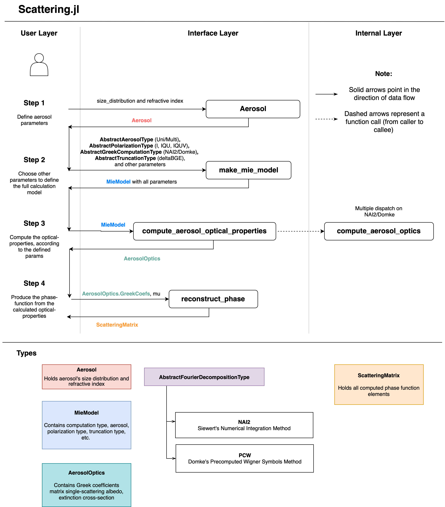

# Scattering Module Overview

The Scattering module computes aerosol optical properties from Mie theory for user-defined size distributions and refractive indices. It supports:

- Siewert NAI-2 and Domke PCW Fourier decomposition methods
- scalar and polarized phase-matrix workflows (`Stokes_I`, `Stokes_IQU`, `Stokes_IQUV`)
- automatic differentiation (AD) for core aerosol parameters (`r_m`, `sigma`, `n_r`, `n_i`)
- phase matrix reconstruction from Greek coefficients for downstream RT use

Primary reference: [Sanghavi (2014)](https://doi.org/10.1016/j.jqsrt.2013.12.015)

## Typical Workflow

1. Create an [`Aerosol`](@ref) from a size distribution and refractive index
2. Build a [`MieModel`](@ref) with [`make_mie_model`](@ref)
3. Compute bulk optical properties with [`compute_aerosol_optical_properties`](@ref)
4. Reconstruct scattering matrix elements with [`reconstruct_phase`](@ref)

For a runnable code walkthrough, see:

- [Scattering example page](Example.md)
- [Scattering tutorial](../tutorials/Tutorial_Scattering.md)

## Core Outputs

`compute_aerosol_optical_properties` returns an [`AerosolOptics`](@ref) object containing:

- `greek_coefs`: `alpha, beta, gamma, delta, epsilon, zeta`
- `omega_tilde`: single scattering albedo
- `k`: bulk extinction cross-section
- `f_t`: truncation factor used by delta-M style workflows
- `derivs` (if AD enabled): Jacobian of outputs with respect to `[r_m, sigma, n_r, n_i]`

## Theory Mapping (Sanghavi 2014)

The table below maps key Scattering APIs to equations/sections in:
[Sanghavi (2014)](https://doi.org/10.1016/j.jqsrt.2013.12.015).

| vSmartMOM API | Theory anchor in paper | Notes |
| --- | --- | --- |
| `compute_aerosol_optical_properties(model::MieModel{NAI2})` | Eq. (1), Fourier framework around Eq. (17), NAI-2 discussion in Secs. 3-4 | Uses Mie-series cross-sections and numerical-angular-integration route to Greek coefficients |
| `phase_function(aerosol, ...)` | Eq. (1), Secs. 3-4 | Returns scalar phase function with `C_ext`, `C_sca`, `g` |
| `compute_aerosol_XS(aerosol, ...)` | Eq. (1) | Cross-section-only path (no Greek reconstruction) |
| `reconstruct_phase(greek_coefs, μ)` | Fourier/Greek matrix representation around Eq. (17) | Rebuilds angle-space matrix elements from stored Greek moments |
| `compute_aerosol_optical_properties(model::MieModel{PCW})` | Eq. (22) for `S_l`, Eq. (24) for Greek coefficients | Direct Domke/PCW route using Wigner-symbol tables |
| `compute_Sl(...)` | Eq. (22) | Internal helper used by PCW implementation |

Implementation notes:
- The code follows Sanghavi's corrected Domke/PCW formalism where applicable.
- Some engineering choices (memory layout, AD wrapping, truncation helpers) are implementation details and not direct one-to-one equation transcriptions.

## API Map (for `miepython` Users)

If you are coming from `miepython`, this is the closest functional mapping:

- `efficiencies(...)` -> `compute_aerosol_XS(...)` or `phase_function(...)` for bulk cross-sections
- `S1_S2(...)` / `phase_matrix(...)` -> `compute_aerosol_optical_properties(...)` + `reconstruct_phase(...)`
- `coefficients(...)` -> low-level `compute_mie_ab!` and `compute_mie_S1S2!` routines
- normalization/RT-oriented outputs -> Greek coefficients + `omega_tilde`, `k`, `f_t`

This module is oriented toward atmospheric RT pipelines where Fourier moments (Greek coefficients) are the main interface.

## Conventions

- Refractive index input uses `n_r` and `n_i >= 0`
- Length units for `lambda`, `r`, and `r_max` must be consistent
- `phase_function(...)` and `compute_aerosol_XS(...)` are convenience APIs when you do not need full Greek-coefficient reconstruction

## Architecture

The design separates expensive Mie/Fourier computation from phase reconstruction:

- `compute_aerosol_optical_properties` computes and stores compact Fourier-space information
- `reconstruct_phase` evaluates angle-dependent scattering matrix elements at arbitrary angular grids

This separation is useful when RT or inversion workflows need repeated matrix reconstruction on different angle grids without recomputing the full Mie solution.
