# 1 · The Problem & the MOM Thesis

> **For:** anyone who has read the landing page and wants to know what the package actually does and *why* MOM is the right tool. Atmospheric scientists, retrieval developers, method developers, theorists, contributors.
>
> **Prev:** [Home](../../index.md) · **Next:** [2 · Vector RTE & Discretization](02_rt_theory.md)

vSmartMOM solves a well-defined problem with a well-chosen method. This page
states the problem, explains why the matrix operator method is the right tool
for it, and lists the eight things that distinguish *this* implementation from
the other MOM codes you might compare it to. Every other page in the Concepts
arc is one segment of the spine introduced at the bottom of this page.

## The problem

Compute the polarized radiance leaving a layered, scattering, absorbing
atmosphere illuminated by the sun, plus analytic Jacobians, fast enough
for retrievals, on whatever hardware the user has.

The Stokes vector ``\mathbf{L}(\mu, \phi) = (I, Q, U, V)^\mathsf{T}`` at the
top of atmosphere (TOA) and bottom of atmosphere (BOA) is a function of:
solar geometry (``\mu_0, \phi_0``), viewing geometry (``\mu, \phi``), and the
vertical structure of the atmosphere — gas absorption, Rayleigh scattering,
aerosols, clouds, the surface BRDF. Modern hyperspectral instruments
(OCO-2/3, GOSAT, EMIT, …) measure ``I`` (and increasingly ``Q``, ``U``) at
millions of monochromatic points, and the retrieval algorithms that infer
trace gas columns, aerosol microphysics, or surface properties from those
measurements need not just ``\mathbf{L}`` but the Jacobian
``\partial \mathbf{L} / \partial \mathbf{x}`` against every retrieval state
``\mathbf{x}``, evaluated inside a Levenberg-Marquardt loop.

That is a four-axis problem: angles × Stokes components × wavelength ×
retrieval parameters. It needs to run in seconds, not hours, for production
retrievals.

## Why MOM

The matrix operator method (Plass & Kattawar, Hovenier, Sanghavi 2014)
maps the per-layer vector RTE to a finite-dimensional matrix operator
``(\mathbf{R}, \mathbf{T}, \mathbf{J})``. Layers compose by linear algebra
— specifically by the *adding equations* (Sanghavi 2014, Eqs 23–28). That
single design choice gives three structural advantages over the
discrete-ordinates, two-stream, and Monte-Carlo families:

1. **Full multiple scattering by construction.** Layer composition is
   matrix multiplication. There is no "single-scatter only" mode that you
   graduate out of, no fixed-point iteration, no Markov-chain convergence.
   The first layer added contributes its single-scatter contribution; each
   subsequent addition picks up all higher orders automatically.

2. **Large optical thickness is cheap.** Doubling reaches optical depth
   ``2^n`` in ``n`` doublings — logarithmic in ``\tau``. Discrete-ordinates
   solvers march in optical depth and slow down with thicker atmospheres;
   Monte Carlo loses photons to absorption. MOM does neither.

3. **Operator-level analytic Jacobians.** Each elemental, doubling, and
   adding step has an exact tangent-linear partner (Sanghavi 2014 App. C).
   The chain rule on the adding-doubling formulas has a compact closed form,
   so the Jacobian costs roughly the same as the forward run. Other codes
   resort to AD-everywhere or finite differences — both pay multiplicative
   overhead.

That's why MOM, in the abstract. The next bullet is what makes *this*
particular MOM implementation different from the others.

## What sets vSmartMOM apart

Every claim below has a `file.jl:LINE` next to it. No marketing.

1. **Operator-level analytic linearization.** The RT solver itself is
   differentiated by hand (Sanghavi 2014 App. C). ForwardDiff is used
   *upstream* at the optical-property boundary — Mie cross-sections,
   atmospheric profile, surface BRDF parameters — never through the
   adding-doubling kernels. That separation keeps the hot loop pure-`FT`
   and lets the analytic chain rule run on GPU.
   *Evidence:* [`src/CoreRT/CoreKernel/lin_added_layer_all_params.jl`](https://github.com/RemoteSensingTools/vSmartMOM.jl/blob/main/src/CoreRT/CoreKernel/lin_added_layer_all_params.jl),
   `src/CoreRT/CoreKernel/{elemental,doubling,interaction}_lin.jl`.

2. **One `@kernel` source compiles for CPU, CUDA, and Metal.** Backend
   dispatch is a one-line method override per extension; the kernel
   bodies are unchanged. Metal works because `KernelAbstractions.@kernel`
   is the abstraction layer, not vendor BLAS.
   *Evidence:* [`src/Architectures.jl:33–96`](https://github.com/RemoteSensingTools/vSmartMOM.jl/blob/main/src/Architectures.jl#L33-L96), [`ext/vSmartMOMCUDAExt.jl:21–27`](https://github.com/RemoteSensingTools/vSmartMOM.jl/blob/main/ext/vSmartMOMCUDAExt.jl#L21-L27),
   [`ext/vSmartMOMMetalExt.jl:19–22`](https://github.com/RemoteSensingTools/vSmartMOM.jl/blob/main/ext/vSmartMOMMetalExt.jl#L19-L22).

3. **Hybrid AD across the GPU boundary.** `ForwardDiff.Dual` numbers flow
   through `NNlib.batched_mul` on `CuArray` — values and partials carried
   through CUBLAS together, no host-device round trips.
   *Evidence:* [`ext/gpu_batched_cuda.jl:141–177`](https://github.com/RemoteSensingTools/vSmartMOM.jl/blob/main/ext/gpu_batched_cuda.jl#L141-L177).

4. **Polarization is a type, not a runtime branch.** `Stokes_I` (``n=1``),
   `Stokes_IQ` (``n=2``), `Stokes_IQU` (``n=3``), `Stokes_IQUV` (``n=4``)
   each subtype `AbstractPolarizationType`. The kernels specialize at
   compile time on the type — there's no `if pol_type.n == 4` branch
   inside the inner loops.
   *Evidence:* [`src/Scattering/types.jl:92–143`](https://github.com/RemoteSensingTools/vSmartMOM.jl/blob/main/src/Scattering/types.jl#L92-L143).

5. **Optical properties as algebra.** ``+`` mixes scatterers in a layer
   (τϖ-weighted ``Z`` averaging); ``*`` stacks layers vertically. Users
   compose layer optics like operands.
   *Evidence:* [`src/CoreRT/types.jl:1063–1101`](https://github.com/RemoteSensingTools/vSmartMOM.jl/blob/main/src/CoreRT/types.jl#L1063-L1101).

6. **Weak GPU dependency** via Julia 1.9 package extensions. CPU-only
   installs are first-class; CUDA and Metal load at runtime if available
   and otherwise stay out of your dependency graph.
   *Evidence:* [`ext/vSmartMOMCUDAExt.jl`](https://github.com/RemoteSensingTools/vSmartMOM.jl/blob/main/ext/vSmartMOMCUDAExt.jl).

7. **Three core variables ``(\tau, \varpi_0, \mathbf{Z})`` per layer.** The
   RT kernel differentiates against these directly, not a black-box scalar
   optical depth, which is why the chain rule is tractable end-to-end.
   *Evidence:* [`src/CoreRT/types_lin.jl:119–149`](https://github.com/RemoteSensingTools/vSmartMOM.jl/blob/main/src/CoreRT/types_lin.jl#L119-L149),
   `src/CoreRT/types.jl:1032+`.

8. **Exact finite-δ elemental, not the linear limit.** Sanghavi 2014
   Eqs. (19)–(20) are written in the ``\delta \to 0`` limit (linear in
   ``\delta``); other MOM codes that stop there need very thin elemental
   layers (large ``N_\mathrm{doubl}``) for that approximation to hold.
   vSmartMOM's elemental kernel uses the exact finite-``\delta`` single-scatter
   formulas (Fell 1997 Eqs 1.52–1.56, restated as SF2023-II Eqs 10–11),
   coded with `-expm1(-x)` and `expdiff_neg(a, b)` for numerical stability
   in `Float32` on GPU. The elemental layer can be thicker at the same
   single-scatter accuracy → smaller ``N_\mathrm{doubl}`` → less round-off
   accumulating through doubling. See [Concepts/04 § Elemental](04_mom_solver.md#elemental-layer)
   for the side-by-side equation comparison.
   *Evidence:* [`src/CoreRT/CoreKernel/elemental.jl:207–252`](https://github.com/RemoteSensingTools/vSmartMOM.jl/blob/main/src/CoreRT/CoreKernel/elemental.jl#L207-L252).

## The narrative thread

```mermaid
flowchart TD
    P["<b>PROBLEM</b><br/>Polarized radiance from a layered<br/>scattering+absorbing atmosphere,<br/>plus Jacobians, fast, on any hardware."]
    W["<b>WHY MOM?</b><br/>Per-layer matrix operator → linear-algebra<br/>composition → full multiple scattering;<br/>large τ cheap (logarithmic via doubling);<br/>exact analytic Jacobians."]
    D["<b>DISCRETIZE</b><br/>Fourier in φ (m=0..max_m),<br/>Gauss/Radau quadrature in μ."]
    A["<b>4 ARRAYS</b><br/>Per Fourier moment m, each layer reduces to<br/>four arrays of shape (NquadN, NquadN, nSpec):<br/>τ, ϖ, Z⁺⁺, Z⁻⁺"]
    B["<b>BUILD LAYER OPTICS</b><br/>Gas absorption (HITRAN LBL) + Mie/Rayleigh +<br/>τϖ-weighted mixing + δ-M truncation +<br/>vertical stacking (RT basics 3, 3a, 3b, 3c)."]
    S["<b>SOLVE (MOM)</b><br/>Per Fourier moment m, layer iz from TOA → BOA:<br/>elemental! → doubling! → interaction!<br/>(RT basics 4)"]
    R["<b>SURFACE</b><br/>BRDF as the bottom-most AddedLayer<br/>(RT basics 5)."]
    L["<b>LINEARIZE</b><br/>Operator-level chain rule on adding-doubling.<br/>ParameterLayout names the Jacobian columns.<br/>Forward + linearized &lt; 2× forward-only<br/>(RT basics 6)."]
    E["<b>EVERYWHERE ON ANY HARDWARE</b><br/>One @kernel source for CPU + CUDA + Metal.<br/>All wavelengths parallel via spectral batch axis.<br/>ForwardDiff Duals flow through GPU batched paths.<br/>(RT basics 7)"]
    P --> W --> D --> A --> B --> S --> R --> L --> E
```

That's the spine. Every page in this RT basics arc is one segment of it.

## Where this thread continues

- [2 · Vector RTE & Discretization](02_rt_theory.md) — write the equation, discretize it, introduce the four arrays.
- [3 · Layer Optical Properties](03_layer_optics.md) — the ``(\tau, \varpi_0, \mathbf{Z}^{++}, \mathbf{Z}^{-+})`` abstraction every layer reduces to.
- [3a · Gas Absorption](03a_absorption.md), [3b · Mie & Rayleigh](03b_scattering.md), [3c · Mixing & δ-M](03c_mixing.md) — how those four arrays are built from physics.
- [4 · The MOM Solver](04_mom_solver.md) — Elemental → Doubling → Adding kernels.
- [5 · Surfaces](05_surfaces.md) — BRDF as the bottom-most AddedLayer.
- [6 · Linearization](06_linearization.md) — the operator-level chain rule.
- [7 · Architecture-Agnostic Code](07_architecture.md) — one kernel source, CPU + CUDA + Metal, all wavelengths in parallel.
- [8 · Inelastic Extension](08_inelastic.md) — Raman / Cabannes (brief).

If you only have time for two pages, read **3 (Layer Optics)** and
**4 (MOM Solver)**. The rest is detail around them.

## Hands-on tutorials

Runnable examples with Plotly figures:

- [Quick Start](../tutorials/Tutorial_QuickStart.md)

## References

- Plass, G. N. & Kattawar, G. W. (1973). *Matrix operator theory of radiative transfer.* Appl. Opt. **12**:314.
- Hovenier, J. W. (1971). *Multiple scattering of polarized light in planetary atmospheres.* Astron. Astrophys. **13**:7.
- Sanghavi, S., Davis, A. B., Eldering, A. (2014). *vSmartMOM: A vector matrix operator method-based radiative transfer model linearized with respect to aerosol properties.* JQSRT **133**:412–433, [doi:10.1016/j.jqsrt.2013.09.004](https://doi.org/10.1016/j.jqsrt.2013.09.004). **(Primary methodological reference.)**
- Jeyaram, R., Sanghavi, S., Frankenberg, C. (2022). *vSmartMOM.jl: An open-source Julia package for atmospheric radiative transfer and remote sensing tools.* JOSS **7**(80):4575, [doi:10.21105/joss.04575](https://doi.org/10.21105/joss.04575). **(Cite this for the package itself.)**
- Full crib sheet: `docs/dev_notes/theory_references.md`.
