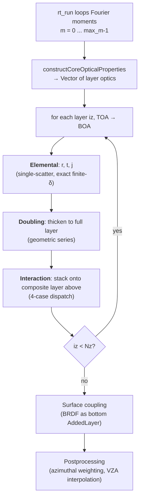

# 4 · The MOM Solver — Elemental → Doubling → Adding

> **For:** anyone reading the RT basics arc top-to-bottom; users debugging RT output; method developers extending the solver.
>
> **Prev:** [3c · Mixing & δ-M Truncation](03c_mixing.md) · **Next:** [5 · Surfaces](05_surfaces.md)

[Concepts/03c](03c_mixing.md) handed the solver a
`Vector{CoreScatteringOpticalProperties}` — one per atmospheric layer, with
the four arrays ``(\tau_\mathrm{scat}, \varpi, \mathbf{Z}^{++}, \mathbf{Z}^{-+})``
plus the per-wavelength total ``\tau_\lambda``. This page is what happens
next.

## Why the solver is fast: spectral axis as the batch axis

The kernel runs once per layer per Fourier moment ``m``. But the third array
dimension is **spectral**: ``\mathbf{R}, \mathbf{T}, \mathbf{J}`` are all
shape `(NquadN, NquadN, nSpec)`. Every operation inside the elemental,
doubling, and interaction kernels is a *batched* matrix op — `batched_mul`
or `batch_inv!` — broadcasting over the spectral axis.

So a line-by-line RT calculation with millions of monochromatic points
becomes one batched matmul per layer per Fourier moment. The
constant-`N_doubl` trick from [Concepts/03c](03c_mixing.md) is what makes
this work — without it, `N_doubl` would vary across the spectral grid and
the batched call would have to be split. With it, the call is uniform.
[Concepts/07](07_architecture.md) explains how that batched call lands on
GPU.

## The per-layer kernel sequence



The orchestrator is `rt_kernel!` in [`src/CoreRT/CoreKernel/rt_kernel.jl:48–229`](https://github.com/RemoteSensingTools/vSmartMOM.jl/blob/main/src/CoreRT/CoreKernel/rt_kernel.jl#L48-L229).
At the top of the layer (TOA, `iz==1`) it copies the added layer directly into
the composite. For all subsequent layers it runs `interaction!`.

## Elemental layer

Two load-bearing points up front.

### 1. Exact finite-δ, not the linear limit

Many MOM codes — including those derived from Sanghavi 2014 Eqs. (19)–(20)
verbatim — use the **infinitesimal-δ limit** of the elemental layer:

```math
\mathbf{T}_\delta = \mathbb{E} + \Bigl[-\mathcal{M}^{-1} + \tfrac{\varpi_0}{2}\,\mathcal{M}^{-1}\bar{\mathbf{Z}}_m^{++}\mathcal{C}\Bigr]\delta,
\qquad
\mathbf{R}_\delta = \tfrac{\varpi_0}{2}\,\mathcal{M}^{-1}\bar{\mathbf{Z}}_m^{-+}\mathcal{C}\,\delta.
```

This is linear in ``\delta``. It is equivalent to the Taylor approximations
``1 - e^{-x} \approx x`` and ``e^{-x} \approx 1 - x``. It is only accurate when
``\delta \to 0`` — i.e. when ``N_\mathrm{doubl}`` is *very* large. Codes that
stop at this form pay a doubling-count tax for that approximation.

vSmartMOM uses the **exact finite-δ single-scatter formulas** from Fell 1997
Eqs. 1.52–1.56, restated as Sanghavi & Frankenberg 2023 Eqs. 10–11:

```math
r^{-+}_{ij}
= \varpi_\lambda\,Z^{-+}_{ij}\,\frac{\mu_j}{\mu_i+\mu_j}\,w_j\,\bigl[1 - e^{-\delta\tau\,(1/\mu_i + 1/\mu_j)}\bigr],
```

```math
t^{++}_{ij} = \varpi_\lambda\,Z^{++}_{ij}\,\frac{\mu_j}{\mu_i-\mu_j}\,w_j\,\bigl[e^{-\delta\tau/\mu_i} - e^{-\delta\tau/\mu_j}\bigr]
\qquad (i \ne j)
```

```math
t^{++}_{ii} = e^{-\delta\tau/\mu_i}\,\Bigl[1 + \varpi_\lambda\,Z^{++}_{ii}\,\frac{\delta\tau}{\mu_i}\,w_i\Bigr]
\qquad (i = j,\ \text{L'Hôpital limit}).
```

These two forms agree as ``\delta \to 0``. For finite ``\delta`` they don't,
and the exact form lets us run with much **larger elemental layers** —
fewer doublings — at the same single-scatter accuracy. Practical
consequences:

- Smaller ``N_\mathrm{doubl}`` for a given layer thickness.
- Less round-off accumulating through the doubling iterations.
- Stable behavior in `Float32` on GPU, where the naive ``1 - e^{-x}`` and
  ``e^{-a} - e^{-b}`` lose precision when ``x`` is small or ``a \approx b``.

The numerical-stability discipline shows up in the actual code
([`src/CoreRT/CoreKernel/elemental.jl:207–252`](https://github.com/RemoteSensingTools/vSmartMOM.jl/blob/main/src/CoreRT/CoreKernel/elemental.jl#L207-L252)):

```julia
# inside the @kernel function get_elem_rt!
r⁻⁺[i,j,n] = ϖ_λ[n] * Z⁻⁺[i,j,n2] *
             (μ[j] / (μ[i] + μ[j])) * wct[j] *
             -expm1(-dτ_λ[n] * (1/μ[i] + 1/μ[j]))   # 1 - exp(-x), stable

if μ[i] == μ[j]
    t⁺⁺[i,j,n] = exp(-dτ_λ[n]/μ[i]) *
                 (1 + ϖ_λ[n] * Z⁺⁺[i,i,n2] * (dτ_λ[n]/μ[i]) * wct[i])
else
    t⁺⁺[i,j,n] = ϖ_λ[n] * Z⁺⁺[i,j,n2] *
                 (μ[j] / (μ[i] - μ[j])) * wct[j] *
                 expdiff_neg(dτ_λ[n]/μ[i], dτ_λ[n]/μ[j])  # exp(-a)-exp(-b), stable
end
```

`-expm1(-x)` computes ``1 - e^{-x}`` to full machine precision when ``x``
is small. `expdiff_neg(a, b)` computes ``e^{-a} - e^{-b}`` to full machine
precision when ``a \approx b``. Both replace error-prone direct evaluations.

### 2. Scattering-only δτ for sizing, total δτ_λ for transmission

Trace the data flow from `init_layer` / `get_dtau_ndoubl` (`rt_kernel.jl:245–298`)
into `elemental!`:

| Variable | What | Source |
|---|---|---|
| `τ` (in `computed_layer_properties`) | scattering optical depth ``\tau_\mathrm{scat}`` | layer-optics build (Concepts/03c) |
| `dτ` | scattering elemental thickness ``\tau_\mathrm{scat}/2^{N_\mathrm{doubl}}`` | `get_dtau_ndoubl` line 251 |
| `dτ_λ` | per-wavelength **total** elemental thickness | passed through to elemental |
| `ϖ_λ` | per-wavelength SSA accounting for absorption | layer-optics build |

Inside the kernel:

- The **scattering source** terms (``\varpi_\lambda Z`` factors in the
  formulas above) are scaled by `dτ_λ`, but the *strength* of the doubling
  step (the ``N_\mathrm{doubl}`` count) was sized by `dτ` (scattering-only).
- The **transmission factors** (``e^{-\delta\tau/\mu}``,
  ``1 - e^{-\delta\tau(1/\mu_i+1/\mu_j)}``, ``e^{-a}-e^{-b}``) use
  ``\delta\tau_\lambda`` so they carry the full per-wavelength absorption.

This is what makes the constant-`N_doubl` trick (SF2023-II Eqs. 8–9) work.
``N_\mathrm{doubl}`` is fixed across the spectral grid because
``\tau_\mathrm{scat}`` is essentially flat across a hyperspectral band, while
``\tau_\lambda`` swings over orders of magnitude through the line-shape
profile. The *transmission* picks up the variation; the *doubling count* does
not.

## Doubling

Once the elemental ``r, t, j`` exist for a thin layer of optical depth
``\delta\tau``, the full layer of optical depth ``\tau = 2^{N_\mathrm{doubl}}\,\delta\tau``
is built by combining the layer with an identical copy of itself ``N_\mathrm{doubl}``
times. Each combination uses the same adding equations (Sanghavi 2014
Eqs. 23–28), simplified by the homogeneity:

```math
(\mathbb{E} - \mathbf{r}^{-+}\mathbf{r}^{-+})^{-1}
\quad\text{is the matrix geometric series capturing all internal reflections.}
```

In code ([`src/CoreRT/CoreKernel/rt_helpers.jl:88–122`](https://github.com/RemoteSensingTools/vSmartMOM.jl/blob/main/src/CoreRT/CoreKernel/rt_helpers.jl#L88-L122)):

```julia
@inline function compute_geometric_progression!(gp_refl, tt_gp, r⁻⁺, t⁺⁺, I_static, temp2, ...)
    temp2 .= I_static .- r⁻⁺ ⊠ r⁻⁺              # (E - R·R)
    batch_inv!(gp_refl, temp2, ...)              # (E - R·R)⁻¹
    tt_gp .= t⁺⁺ ⊠ gp_refl                       # T · (E - R·R)⁻¹
end

@inline function doubling_source_update!(j₀⁺, j₀⁻, j₁⁺, j₁⁻, r⁻⁺, tt_gp, expk)
    j₀⁻ .= j₀⁻ .+ (tt_gp ⊠ (j₁⁻ .+ r⁻⁺ ⊠ j₀⁺))
    j₀⁺ .= j₁⁺ .+ (tt_gp ⊠ (j₀⁺ .+ r⁻⁺ ⊠ j₁⁻))
end

@inline function doubling_rt_update!(r⁻⁺, t⁺⁺, tt_gp, expk)
    r⁻⁺ .= r⁻⁺ .+ (tt_gp ⊠ r⁻⁺ ⊠ t⁺⁺)             # R += T·(E-R·R)⁻¹·R·T
    t⁺⁺ .= tt_gp ⊠ t⁺⁺                            # T  ←  T·(E-R·R)⁻¹·T
    expk .= expk .^ 2                             # e^{-δτ/μ₀} squared per doubling
end
```

The operator `⊠ = NNlib.batched_mul` is batched over the spectral axis. One
call covers all wavelengths.

After ``N_\mathrm{doubl}`` iterations, the layer thickness is ``2^{N_\mathrm{doubl}}\,\delta\tau``.
That's the **logarithmic-in-τ** advantage of MOM: doubling reaches optical
depth ``2^n`` in ``n`` doublings.

### The `apply_D!` kernel — D-matrix symmetry

For a homogeneous layer, the four operators are not independent:

```math
\mathbf{T}_{ab} = \mathbf{D}\,\mathbf{T}_{ba}\,\mathbf{D},\qquad
\mathbf{R}_{ab} = \mathbf{D}\,\mathbf{R}_{ba}\,\mathbf{D},\qquad
\mathbf{D} = \operatorname{diag}(1,1,-1,-1).
```

That's Sanghavi 2014 Eqs. (29)–(30). The trick is that you only need to
compute *one* direction during the doubling loop, then recover the other.
Sanghavi 2014 Eq. (31) defines a starred quantity:

```math
\mathbf{R}^{*}_{10} = \mathbf{D}\,\mathbf{R}_{10}.
```

The doubling inner loop manipulates ``\mathbf{R}^{*}_{10}`` in place of both
``\mathbf{R}_{10}`` and ``\mathbf{R}_{01}`` (which are equal for a homogeneous
layer). After the loop, recover the four operators via Eq. (32):

```math
\mathbf{T}_{ba} = \mathbf{T}_{ba},\quad
\mathbf{R}_{ba} = \mathbf{D}\,\mathbf{R}^{*}_{ba},\quad
\mathbf{T}_{ab} = \mathbf{D}\,\mathbf{T}_{ba}\,\mathbf{D},\quad
\mathbf{R}_{ab} = \mathbf{R}^{*}_{ba}\,\mathbf{D}.
```

`apply_D!` ([`src/CoreRT/CoreKernel/doubling.jl:85–110`](https://github.com/RemoteSensingTools/vSmartMOM.jl/blob/main/src/CoreRT/CoreKernel/doubling.jl#L85-L110)) does this in two
in-place passes:

```julia
@kernel function apply_D!(n_stokes::Int, r⁻⁺, t⁺⁺, r⁺⁻, t⁻⁻)
    iμ, jμ, n = @index(Global, NTuple)
    i = mod1(iμ, n_stokes)            # which Stokes component is the row?
    j = mod1(jμ, n_stokes)            # which Stokes component is the column?

    # Pass 1: row-multiply r⁻⁺ by D = diag(1,1,-1,-1) — i.e. negate rows i > 2.
    # After this, r⁻⁺ holds R*_10 = D · R_10.
    if (i > 2)
        r⁻⁺[iμ,jμ,n] = -r⁻⁺[iμ,jμ,n]
    end

    # Pass 2: write the reverse-direction operators using the (i,j)-parity sign
    # table for D[i]·D[j] = ±1.  Same-parity (both ≤ 2 or both > 2) → +1; mixed → −1.
    if ((i <= 2) & (j <= 2)) | ((i > 2) & (j > 2))
        r⁺⁻[iμ,jμ,n] =  r⁻⁺[iμ,jμ,n]
        t⁻⁻[iμ,jμ,n] =  t⁺⁺[iμ,jμ,n]
    else
        r⁺⁻[iμ,jμ,n] = -r⁻⁺[iμ,jμ,n]
        t⁻⁻[iμ,jμ,n] = -t⁺⁺[iμ,jμ,n]
    end
end
```

The kernel is a single `@kernel` — the same source compiles to CPU, CUDA, and
Metal. See [Concepts/07](07_architecture.md) for the dispatch story.

## Adding / Interaction

Doubling builds a single homogeneous layer. *Adding* combines layers with
different optical properties — the actual atmospheric column. The
`interaction!` kernel in [`src/CoreRT/CoreKernel/interaction.jl:14–136`](https://github.com/RemoteSensingTools/vSmartMOM.jl/blob/main/src/CoreRT/CoreKernel/interaction.jl#L14-L136)
dispatches on a `ScatteringInterface_*` type chosen once per layer by
`extractEffectiveProps`:

| Type | Composite scatters? | Added scatters? | What runs |
|---|---|---|---|
| `ScatteringInterface_00` | no | no | transmission cascade only |
| `ScatteringInterface_01` | no | yes | added layer reflection couples in |
| `ScatteringInterface_10` | yes | no | composite reflection couples in |
| `ScatteringInterface_11` | yes | yes | full S2014 Eqs. (23)–(28) |

The dispatch is on a **type**, not a runtime branch. Each interface subtypes
`AbstractScatteringInterface` and the kernel specializes at compile time.

### The full case (`ScatteringInterface_11`)

This is the algebraic heart of MOM. Two batched matrix inversions per call
form the geometric-series factors that capture infinitely many reflections
between the composite atmosphere above and the new added layer below:

```julia
temp2 .= I_static .- r⁻⁺ ⊠ R⁺⁻              # (E − r⁻⁺ R⁺⁻)
batch_inv!(temp1, temp2, ...)
T01_inv = T⁻⁻ ⊠ temp1                       # T⁻⁻ · (E − r⁻⁺ R⁺⁻)⁻¹

temp2 .= I_static .- R⁺⁻ ⊠ r⁻⁺              # (E − R⁺⁻ r⁻⁺)
batch_inv!(temp1, temp2, ...)
T21_inv = t⁺⁺ ⊠ temp1                       # t⁺⁺ · (E − R⁺⁻ r⁻⁺)⁻¹
```

Then the composite operators are updated in place (lowercase = added,
uppercase = composite):

```julia
# Source vectors first (depend on old R⁻⁺/T⁻⁻):
J₀⁻ .= J₀⁻ .+ T01_inv ⊠ (r⁻⁺ ⊠ J₀⁺ .+ j₀⁻)

# Reflection in opposite direction picks up coupling from below:
R⁻⁺ .= R⁻⁺ .+ T01_inv ⊠ r⁻⁺ ⊠ T⁺⁺
T⁻⁻ .= T01_inv ⊠ t⁻⁻

# And the symmetric updates from above into the added layer:
J₀⁺ .= j₀⁺ .+ T21_inv ⊠ (J₀⁺ .+ R⁺⁻ ⊠ j₀⁻)
T⁺⁺ .= T21_inv ⊠ T⁺⁺
R⁺⁻ .= r⁺⁻ .+ T21_inv ⊠ R⁺⁻ ⊠ t⁻⁻
```

These are Sanghavi 2014 Eqs. (23)–(28) for the layered atmosphere. The
``(E - r^{-+} R^{+-})^{-1}`` factor is the matrix geometric series capturing
all photon paths that bounce between the two layers any number of times before
escaping.

The other three `ScatteringInterface_*` cases drop terms that are zero by
construction — for instance, `_00` is just a transmission cascade
``\mathbf{T}_\mathrm{new} = \mathbf{t}\,\mathbf{T}``.

## Code anchors

| Concept | Source |
|---|---|
| Per-layer kernel dispatch | [`src/CoreRT/CoreKernel/rt_kernel.jl:48–229`](https://github.com/RemoteSensingTools/vSmartMOM.jl/blob/main/src/CoreRT/CoreKernel/rt_kernel.jl#L48-L229) |
| Elemental kernel (driver) | [`src/CoreRT/CoreKernel/elemental.jl:38–139`](https://github.com/RemoteSensingTools/vSmartMOM.jl/blob/main/src/CoreRT/CoreKernel/elemental.jl#L38-L139) |
| `@kernel get_elem_rt!` (exact finite-δ formulas) | [`src/CoreRT/CoreKernel/elemental.jl:207–252`](https://github.com/RemoteSensingTools/vSmartMOM.jl/blob/main/src/CoreRT/CoreKernel/elemental.jl#L207-L252) |
| `init_layer` / `get_dtau_ndoubl` | [`src/CoreRT/CoreKernel/rt_kernel.jl:245–298`](https://github.com/RemoteSensingTools/vSmartMOM.jl/blob/main/src/CoreRT/CoreKernel/rt_kernel.jl#L245-L298) |
| Doubling driver | [`src/CoreRT/CoreKernel/doubling.jl:13–51`](https://github.com/RemoteSensingTools/vSmartMOM.jl/blob/main/src/CoreRT/CoreKernel/doubling.jl#L13-L51) |
| Geometric series + RT updates | [`src/CoreRT/CoreKernel/rt_helpers.jl:88–122`](https://github.com/RemoteSensingTools/vSmartMOM.jl/blob/main/src/CoreRT/CoreKernel/rt_helpers.jl#L88-L122) |
| `@kernel apply_D!` | [`src/CoreRT/CoreKernel/doubling.jl:85–110`](https://github.com/RemoteSensingTools/vSmartMOM.jl/blob/main/src/CoreRT/CoreKernel/doubling.jl#L85-L110) |
| Interaction (4 cases) | [`src/CoreRT/CoreKernel/interaction.jl:14–136`](https://github.com/RemoteSensingTools/vSmartMOM.jl/blob/main/src/CoreRT/CoreKernel/interaction.jl#L14-L136) |
| `ScatteringInterface_*` types | `src/CoreRT/types.jl::AbstractScatteringInterface` |
| `extractEffectiveProps` (picks the interface type) | [`src/CoreRT/LayerOpticalProperties/compEffectiveLayerProperties.jl:75–93`](https://github.com/RemoteSensingTools/vSmartMOM.jl/blob/main/src/CoreRT/LayerOpticalProperties/compEffectiveLayerProperties.jl#L75-L93) |

## Hands-on tutorials

Runnable examples with Plotly figures:

- [CoreRT walkthrough](../tutorials/Tutorial_CoreRT.md)
- [Quick Start (5-min run)](../tutorials/Tutorial_QuickStart.md)

## References

- **Sanghavi et al. (2014)**, JQSRT **133**:412–433, [doi:10.1016/j.jqsrt.2013.09.004](https://doi.org/10.1016/j.jqsrt.2013.09.004). Eqs. (19)–(32). **Primary methodological reference.**
- **Fell (1997)**, PhD thesis, FU Berlin. Eqs. 1.52–1.56 — exact finite-δ elemental formulas the code implements.
- **Sanghavi & Frankenberg (2023)**, JQSRT **311**:108791, [doi:10.1016/j.jqsrt.2023.108791](https://doi.org/10.1016/j.jqsrt.2023.108791). Eqs. (10)–(11) — restate Fell's elemental formulas; Eqs. (8)–(9) — constant-`N_doubl` trick.
- Plass & Kattawar (1973), *Matrix operator theory of radiative transfer*, Appl. Opt. **12**:314.
- Crib sheet: `docs/dev_notes/theory_references.md` §B, §C.
