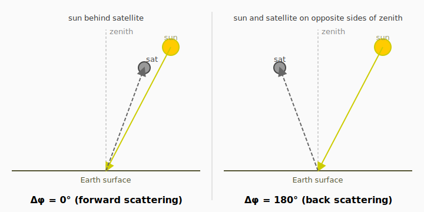

# Conventions

Polarized radiative transfer codes have to commit to a specific set of sign,
phase-matrix, and angle conventions. Different lineages (Hovenier-Sanghavi,
Mishchenko-VLIDORT, Stamnes-DISORT, …) made different choices, and the
choices are largely interchangeable *as long as you stay inside one
convention*. The pain hits when you cross-validate two codes that quietly
follow different conventions.

This page first lays out **the conventions vSmartMOM uses internally**, then
shows **how they differ from VLIDORT** so you know exactly where to apply
sign flips when comparing or importing data.

If you only read one section, read **§4 — comparing against VLIDORT**.

---

## 1. Stokes vector and reference plane

vSmartMOM uses the standard **Stokes vector** ``(I, Q, U, V)`` defined with
respect to the **meridian plane**: the vertical plane containing the
zenith direction and the propagation direction. ``Q > 0`` means linear
polarization parallel to the meridian plane; ``U > 0`` means linear
polarization at +45° from the meridian; ``V > 0`` is right-circular
polarization (looking *toward* the source).

This is the **Hovenier–van der Mee–Domke convention** (Hovenier &
van der Mee 1983; Hovenier, van der Mee & Domke 2004). It is the same
convention used in Sanghavi's vSmartMOM theory papers
(Sanghavi 2014; Sanghavi & Stephens 2015).

The polarization-type variants `Stokes_I`, `Stokes_IQ`, `Stokes_IQU`,
`Stokes_IQUV` simply truncate this vector — they don't change the
sign convention.

---

## 2. Phase matrix and Greek coefficients

The single-scattering phase matrix in vSmartMOM is expanded in
generalized spherical functions following de Rooij & van der Stap
(1984). The Greek-coefficient block-diagonal structure is:

```
         ⎡ β_l   γ_l    0     0   ⎤
   B_l = ⎢ γ_l   α_l    0     0   ⎥
         ⎢  0     0    ζ_l   ε_l ⎥
         ⎣  0     0   −ε_l   δ_l ⎦
```

with ``α_l, β_l, γ_l, δ_l, ε_l, ζ_l ∈ ℝ`` (per Legendre order ``l``).
This matches the `GreekCoefs` struct in
[`src/Scattering/types.jl`](https://github.com/RemoteSensingTools/vSmartMOM.jl/blob/main/src/Scattering/types.jl)
and `construct_B_matrix` in
[`src/Scattering/mie_helper_functions.jl`](https://github.com/RemoteSensingTools/vSmartMOM.jl/blob/main/src/Scattering/mie_helper_functions.jl).

The off-diagonal ``γ_l`` couples ``I↔Q`` (and is therefore the dominant
driver of single-scattering polarization). ``ε_l`` is **anti-symmetric**
in the [3,4]/[4,3] block (`B[3,4] = +ε`, `B[4,3] = −ε`), the standard
Hovenier convention.

**Sign convention for ``γ`` at L=2 (Rayleigh)**: vSmartMOM's
`get_greek_rayleigh` returns

```julia
γ[L=2] = +√(3/2) · dpl_p          # Hovenier-positive
```

with `dpl_p = (1 − δ)/(1 + δ/2)`. This is consistent with vSmartMOM's
own Mie code (`compute_NAI2.jl:132`, where `f₁₂ = −Re(|s1|² − |s2|²)`),
so the entire vSmartMOM internal pipeline is **self-consistent in
Hovenier convention**.

---

## 3. Azimuth angle (Δφ)

vSmartMOM defines the **relative azimuth** ``Δφ = φ_view − φ_sun`` (in
degrees), with:

```
   Δφ = 0°    ⇔   sun directly behind the satellite (forward scattering)
   Δφ = 180°  ⇔   sun and satellite on opposite sides of the
                  zenith within the principal plane (back scattering)
```



The Fourier reconstruction in
[`src/CoreRT/tools/postprocessing_vza.jl`](https://github.com/RemoteSensingTools/vSmartMOM.jl/blob/main/src/CoreRT/tools/postprocessing_vza.jl)
weights ``I, Q`` by ``\cos(m \, \Delta\varphi)`` and ``U, V`` by
``\sin(m \, \Delta\varphi)`` for each Fourier moment ``m``. This is the
de Haan–Bosma–Hovenier (1987) convention.

Consequence: at ``Δφ = 0°`` (and ``180°``), ``\sin(m \, \Delta\varphi) = 0``
for all ``m``, so **U and V are identically zero in the principal plane
under this convention**. If a comparison code reports non-zero U/V at the
principal plane, it is using a different rotation convention.

---

## 4. Comparing against VLIDORT (and other codes)

VLIDORT (Spurr 2006, 2008; the V2.8.x series and PyVLIDORT) uses a
**partially different** convention set. The differences that matter when
cross-validating are summarised below.

### 4.1 Greek coefficients — γ at L=2

| Quantity | vSmartMOM (Hovenier) | VLIDORT (Mishchenko-style) |
|----------|----------------------|----------------------------|
| Rayleigh γ[L=2] | ``+\sqrt{3/2}\,d_{pl}`` | ``-\sqrt{6}\,\beta_2`` (same magnitude, **opposite sign**) |
| Aerosol γ[L=2..N] from `PROBLEM_IIA(3,:)` / `PROBLEMIII_b1` | sign-flip on import | as-is in data file |

When importing aerosol Greek coefficients from VLIDORT-format data files
(Siewert 2000 `PROBLEM_IIA(3,:)`, VLIDORT solar_tester `PROBLEMIII_b1`),
**flip the sign of γ on the way in** so the imported aerosol γ is in
vSmartMOM's Hovenier convention and matches the internally-generated
Rayleigh γ. Otherwise the mixed-layer ``Z`` matrix accumulates from
inconsistent signs.

`ε` from `PROBLEM_IIA(5,:)` / `PROBLEMIII_b2` also needs a sign flip
(``\epsilon = -\text{column}_5``), per `GREEKMAT(:,12) = -PROBLEM_IIA(5,:)`
in the VLIDORT driver. This is widely-known and documented in the
existing test reference files.

### 4.2 Stokes Q, U, V signs

Because vSmartMOM and VLIDORT use opposite γ sign conventions internally,
**Q, U, AND V come out with opposite signs** when you compare a
vSmartMOM run to a VLIDORT-produced reference table.

When validating against a VLIDORT-format truth (e.g.
`results_solar_tester_IQU0.all`, `results_Siewert2000_validation.all`),
flip the sign of truth Q, U, and V before computing residuals:

```julia
truth_Q_compare = -truth_Q_vlidort
truth_U_compare = -truth_U_vlidort
truth_V_compare = -truth_V_vlidort
```

**Why all three flip together**: the I↔Q coupling (γ) propagates through
the multi-scatter Mueller matrix to Q↔U (via α) and to V (via ε), so a
single γ-sign flip cascades to every linear-polarization component.
Confirmed empirically in Case A (Siewert 2000): symmetric flip preserves
agreement at ~1e-6 across all four Stokes components.

### 4.3 Azimuth (RAZ) — same convention

vSmartMOM and VLIDORT use the **same** Δφ convention (forward at 0°,
back at 180°), confirmed by Sanghavi (2026). Some other atmospheric RT
codes use the opposite labeling — be aware of this if you import data
from a non-VLIDORT source.

### 4.4 Worked example: Case A in the test suite

The cross-validation `test/vlidort_baseline/cases/case_A_siewert2000.jl`
runs Siewert 2000 PROBLEM_IIA against VLIDORT 2.8.3 saved_results.
Applying:

  1. γ sign-flip on import
     (`SIEWERT_γ = .-SIEWERT_PROBLEM_IIA.row3`)
  2. Truth Q/U/V sign-flip at comparison
     (`truth = -truth` for Q, U, V)

vSmartMOM matches VLIDORT to **~1e-6 max relative error across all 4
Stokes components, all 3 azimuths (0°, 90°, 180°), all 11 viewing
zenith angles**. This is the empirical validation of the convention
story above.

---

## 5. Quick reference: import/export checklist

When importing greek coefficients from a **VLIDORT-format** file
(Siewert 2000, PROBLEMIII, …):

| Field | Action on import |
|-------|------------------|
| α (a2 / row1) | as-is |
| β (a1 / row2) | as-is |
| γ (b1 / row3) | **flip sign** (Mishchenko → Hovenier) |
| δ (a4 / row4) | as-is |
| ε (b2 / row5) | **flip sign** (`B[3,4]` storage convention) |
| ζ (a3 / row6) | as-is |

When comparing vSmartMOM output Stokes against a **VLIDORT-format**
truth table:

| Stokes | Action on truth side |
|--------|----------------------|
| I | as-is |
| Q | **flip sign** |
| U | **flip sign** |
| V | **flip sign** |

When the source data is from a **Hovenier-tradition** code (Sanghavi,
Hovenier, Natraj 1980, …), no flips are needed — vSmartMOM and the
source already agree.

---

## 6. Quadrature streams: `Nstreams` vs `Nquad`

Two distinct stream counts live on `QuadPoints`. Surfacing the
distinction prevents the kind of silent mismatch that bit the Natraj
2009 benchmark (where `l_trunc=20` derived 11 nodes in Gauss but 10 in
Radau because of a per-scheme formula difference; see commit
`f9403eb`).

- **`Nstreams`** — count of nonzero weights (`count(!iszero, wt_μ)`).
  This is the user-facing **resolving-power** knob. The public
  contract is

  ```
  stream_l_cap = 2·Nstreams - 1
  ```

  i.e., the largest Legendre order the chosen quadrature is contracted
  to resolve. Set `radiative_transfer.nstreams = N` in YAML; the
  engine guarantees `2·N - 1` resolving order regardless of which
  quadrature scheme is chosen.

- **`Nquad`** — total node count, including zero-weight SZA/VZA
  *output nodes* appended for postprocessing. Used for kernel
  workspace sizing (`NquadN = Nquad · n_stokes`). Always satisfies
  `Nquad ≥ Nstreams + length(unique([sza; vza]))`.

### Per-scheme construction

| Scheme | Weighted-streams construction | Nstreams (pre-augmentation) |
|--------|-------------------------------|-----------------------------|
| `GaussLegQuad` | Gauss-Legendre on `[0, 1]`, `(Ltrunc+2)÷2` nodes (Sanghavi: `+2` form avoids zero streams at `Ltrunc=0`) | `(Ltrunc+2)÷2` |
| `RadauQuad` | Gauss-Radau on subintervals around μ₀; SZA-on-node branch builds `(Ltrunc+1)÷2` nodes, SZA-not-on-node branch builds `2·((Ltrunc+1)÷2)` weighted nodes split around μ₀ | `count(!iszero, wt_μ)` after construction |

Because Radau allocates a different number of weighted nodes
depending on whether μ₀ lands on a Gauss-Radau abscissa, the
`Nstreams` field is computed as `count(!iszero, wt_μ)` rather than a
formula — this guarantees it matches what the builder actually
produced. Radau's split-around-μ₀ branch typically uses **more**
weighted streams than Gauss for the same `Ltrunc`, which is one
reason Radau is more expensive; Sanghavi recommends `GaussLegQuad`
as the default. Radau remains available for users who need an
SZA-on-node quadrature but is documented as expert/legacy.

After SZA + VZAs are appended as zero-weight output nodes, both
schemes report the same fields:

- `qp.Nstreams` = weighted streams (resolving power)
- `qp.Nquad` = augmented total (kernel size)
- `qp.wt_μ` carries explicit zeros at the appended SZA/VZA positions

The `RTModel` `Base.show` summary prints both: `"Nstreams=N, Nquad=M"`.

---

## 7. Where this lives in code

| Concept | File |
|---------|------|
| Hovenier B-matrix construction | [`src/Scattering/mie_helper_functions.jl`](https://github.com/RemoteSensingTools/vSmartMOM.jl/blob/main/src/Scattering/mie_helper_functions.jl) (`construct_B_matrix`) |
| Rayleigh γ (Hovenier-positive) | [`src/Scattering/mie_helper_functions.jl`](https://github.com/RemoteSensingTools/vSmartMOM.jl/blob/main/src/Scattering/mie_helper_functions.jl) (`get_greek_rayleigh`) |
| Mie coefficient sign (compute_NAI2 f₁₂) | [`src/Scattering/compute_NAI2.jl`](https://github.com/RemoteSensingTools/vSmartMOM.jl/blob/main/src/Scattering/compute_NAI2.jl) |
| Azimuth weighting (sin/cos by Stokes) | [`src/CoreRT/tools/postprocessing_vza.jl`](https://github.com/RemoteSensingTools/vSmartMOM.jl/blob/main/src/CoreRT/tools/postprocessing_vza.jl) |
| VLIDORT cross-validation (worked example) | [`test/vlidort_baseline/`](https://github.com/RemoteSensingTools/vSmartMOM.jl/blob/main/test/vlidort_baseline/) |

---

## References

- de Rooij, W.A. & van der Stap, C.C.A.H. (1984). *Expansion of Mie
  scattering matrices in generalized spherical functions.* A&A 131, 237.
- de Haan, J.F., Bosma, P.B. & Hovenier, J.W. (1987). *The adding method
  for multiple scattering calculations of polarized light.* A&A 183, 371.
- Hovenier, J.W., van der Mee, C., & Domke, H. (2004). *Transfer of
  Polarized Light in Planetary Atmospheres — Basic Concepts and
  Practical Methods.* Springer / Kluwer.
- Mishchenko, M.I., Travis, L.D., & Lacis, A.A. (2002). *Scattering,
  Absorption, and Emission of Light by Small Particles.* CUP.
- Natraj, V., Hovenier, J.W. (2012). *Polarized light reflected and
  transmitted by thick Rayleigh scattering atmospheres.* ApJ 748, 28.
- Sanghavi, S. (2014). *Revisiting the Fourier expansion of Mie
  scattering matrices in generalized spherical functions.* JQSRT 136,
  16–27.
- Sanghavi, S. & Stephens, G. (2015). *Adaptation and use of forward
  models in retrieval algorithms.* JQSRT 156, 24–37.
- Siewert, C.E. (2000). *A discrete-ordinates solution for radiative
  transfer models that include polarization effects.* JQSRT 64, 227–254.
- Spurr, R.J.D. (2006). *VLIDORT: A linearized pseudo-spherical
  vector discrete ordinate radiative transfer code...* JQSRT 102, 316.
