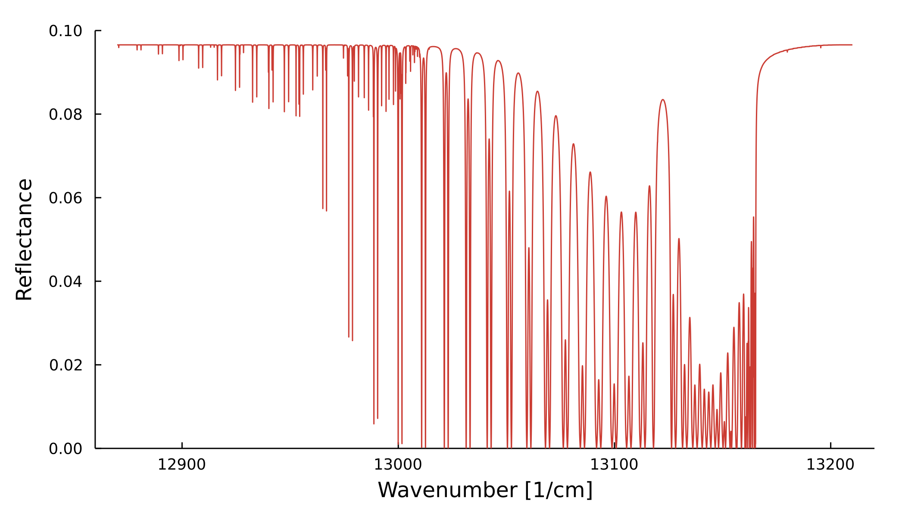
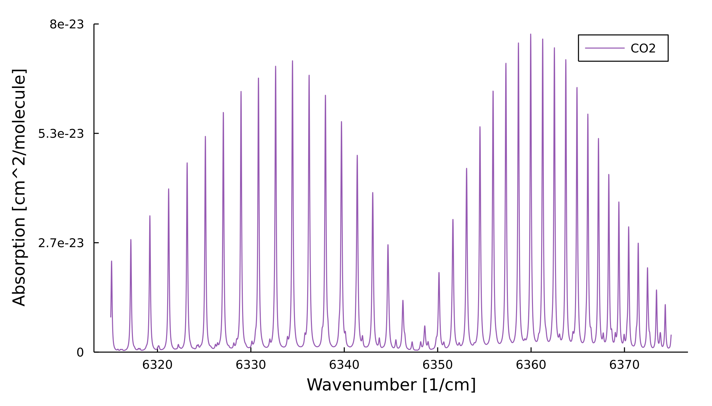

# Summary

Remote sensing researchers use radiative transfer modeling to interpret satellite data for studying Earth's atmospheric and surface properties. The field plays a key role in how scientists understand many aspects of our rapidly changing planet – from climate change and pollution to the carbon and water cycles. Astronomers use radiative transfer to study the atmospheres of stars and substellar objects like brown dwarfs and exoplanets. 

**vSmartMOM.jl** is a [Julia](https://julialang.org) package that enables the fast computation of atmospheric optical properties and fully-polarized multiple-scattering radiance simulations, based on the Matrix Operator Method [@Sanghavi:2013a]. Users are free to customize simulation parameters and atmospheric properties, including trace-gas profiles, aerosol distributions, microphysical properties, surface reflectance, and quadrature schemes. Independent submodules can also be imported individually; for example, **Absorption.jl** can be used for computing gaseous absorption and **Scattering.jl** for computing scattering phase-functions. 

The Julia language provides many exciting opportunities to modernize radiative transfer software. Using the ForwardDiff.jl package [@Revels:2016], Jacobians can be calculated alongside computations using automatic differentiation, allowing for elegant and straightforward parameter-fitting. Julia's multiple dispatch paradigm enables the software architecture to be clean, flexible and reusable. Additionally, optimized techniques have been implemented to speed up the package’s performance on both CPU and GPU by orders-of-magnitude compared to existing radiative transfer codes. 

**vSmartMOM.jl** has already been used in research projects, ranging from methane-plume simulation to aerosol profile fitting and spectropolarimetric simulations of brown dwarfs and exoplanets. It has also been used in graduate-level remote sensing coursework. Ultimately, **vSmartMOM.jl** aims to accelerate the pace of atmospheric research through efficient software while lowering the barrier-of-entry for researchers and students in remote sensing. 

# Statement of need

For historical reasons, much of the scientific work in remote sensing is based on legacy code, written in Fortran or C/C++, mixed with “glue languages” such as Python. Researchers who developed these codes also placed greater emphasis on science results than software engineering best practices. As a result, many parts of key codebases are aging, convoluted, and hard to improve by both incoming graduate students and experienced researchers. 

Rather than simply *porting* these codes to a new language, **vSmartMOM.jl** redesigns the radiative transfer code from the ground up to include new functionalities like GPU acceleration and automatic differentiation – features that have become computationally feasible and widespread only in the last decade. 

# Overview of functionality

The package has a modular architecture, allowing users to import just the specific module(s) that they need.

**vSmartMOM.jl** is the top-level module that uses absorption and scattering submodules to carry out radiative transfer simulations. Specifically, it: 

- Enables 1D vectorized plane-parallel RT modeling based on the Matrix Operator Method [@Sanghavi:2013a]
- Incorporates fast, high fidelity simulations of scattering atmospheres containing haze and clouds, including pressure- and temperature-resolved absorption profiles of gaseous species in the atmosphere
- Enables GPU-accelerated computations of the resulting hyperspectral multiple-scattering radiative transfer
- Enables auto-differentiation of the output spectrum with respect to various input parameters, allowing for spectral fitting routines to estimate atmospheric parameters

**Absorption.jl** enables absorption cross-section calculations of atmospheric gases at different pressures, temperatures, and wavelengths. It uses the HITRAN [@Gordon:2017] database for calculations. For exoplanets and brown dwarfs, spectra are obtained from the ExoMOL/HITEMP databases [@yurchenko2012exomol:2012; @rothman2010hitemp:2010]. While it enables lineshape calculations from scratch, the module also allows users to create and save an interpolator object at specified wavelength, pressure, and temperature grids. The module also supports auto-differentiation of the profile, with respect to pressure and temperature. Calculations can be computed either on CPU or GPU (CUDA).

**Scattering.jl** is used for calculating Mie scattering phase-functions for aerosols with specified size distributions and refractive indices. This module enables scattering phase-function calculation of atmospheric aerosols with different size distributions, incident wavelengths, and refractive indices. It can perform the calculation using either numerical integration using quadrature points (NAI-2) [@Siewert:1982] or using precomputed tabulations of Wigner 3-j symbols (PCW) [@Domke:1975] with recent corrections [@Sanghavi:2013b]. State-of-the-art methods like $\delta$-truncation [@Hu:2000] and $\delta$-BGE truncation [@Sanghavi:2015] are used for scalar and vector radiative transfer computations, respectively. The module also supports auto-differentiation of the phase function, with respect to the aerosol's size distribution parameters and its complex refractive index. 

# Benchmarks

Standard reference tables from the literature [@Natraj:2009] are used to validate **vSmartMOM.jl** simulation output. The data is available in **Appendix 1**, in **Tables 1-3**. The key result is that simulated reflectance output from vSmartMOM.jl closely matches published standard values – always within 0.1% for I, 0.0005 for Q, and 0.0001 for U. 

Runtime duration for a given simulation is also compared between using CPU and GPU architectures. (CPU architecture is single-threaded, AMD EPYC 7H12 64-Core Processor; GPU is parallel on an NVIDIA A100 Tensor Core (40Gb))

A nearly 100x speedup is observed when using the GPU architecture on the same simulation. 

Hardware acceleration, in addition to algorithmic efficiencies and performance optimizations in **vSmartMOM.jl** suggest that this package can greatly accelerate the pace of remote sensing research. 

# Acknowledgements

We thank Frankenberg lab members for their enthusiastic support and guidance throughout this project. We also acknowledge support from Caltech’s Schmidt Academy for Software Engineering.

# Appendix 

In the tables below, **bold** numbers are vSmartMOM.jl output values and non-bold numbers are the published values from the literature [@Natraj:2009]. 

| $\mu$ | $\phi$ = 0°            | $\phi$ = 30°           | $\phi$ = 60°           | $\phi$ = 90°           | $\phi$ = 120°          | $\phi$ = 150°          | $\phi$ = 180°          |
| :---  | :---                   | :---                   | :---                   | :---                   | :---                   | :---                   | :---                   |
| 0.02  | **0.4410**   0.4413 | **0.3942**   0.3944 | **0.3007**   0.3009 | **0.2545**   0.2547 | **0.3023**   0.3025 | **0.3970**   0.3973 | **0.4442**   0.4445 |
| 0.06  | **0.3921**   0.3925 | **0.3519**   0.3522 | **0.2719**   0.2721 | **0.2332**   0.2334 | **0.2762**   0.2764 | **0.3594**   0.3597 | **0.4007**   0.4011 |
| 0.10  | **0.3505**   0.3508 | **0.3154**   0.3158 | **0.2460**   0.2462 | **0.2133**   0.2135 | **0.2524**   0.2526 | **0.3264**   0.3268 | **0.3632**   0.3635 |
| 0.16  | **0.2983**   0.2986 | **0.2694**   0.2697 | **0.2126**   0.2128 | **0.1869**   0.1870 | **0.2212**   0.2214 | **0.2844**   0.2847 | **0.3155**   0.3159 |
| 0.20  | **0.2690**   0.2694 | **0.2435**   0.2438 | **0.1935**   0.1937 | **0.1716**   0.1717 | **0.2032**   0.2034 | **0.2604**   0.2607 | **0.2885**   0.2889 |
| 0.28  | **0.2212**   0.2215 | **0.2011**   0.2014 | **0.1620**   0.1622 | **0.1461**   0.1462 | **0.1733**   0.1734 | **0.2206**   0.2209 | **0.2437**   0.2441 |
| 0.32  | **0.2016**   0.2019 | **0.1837**   0.1839 | **0.1491**   0.1492 | **0.1355**   0.1356 | **0.1608**   0.1610 | **0.2041**   0.2043 | **0.2251**   0.2254 |
| 0.40  | **0.1687**   0.1689 | **0.1545**   0.1547 | **0.1274**   0.1275 | **0.1178**   0.1179 | **0.1398**   0.1399 | **0.1759**   0.1761 | **0.1934**   0.1936 |
| 0.52  | **0.1308**   0.1310 | **0.1210**   0.1212 | **0.1027**   0.1028 | **0.0976**   0.0976 | **0.1152**   0.1153 | **0.1427**   0.1429 | **0.1558**   0.1560 |
| 0.64  | **0.1022**   0.1023 | **0.0959**   0.0960 | **0.0844**   0.0844 | **0.0824**   0.0824 | **0.0962**   0.0963 | **0.1164**   0.1165 | **0.1259**   0.1261 |
| 0.72  | **0.0868**   0.0868 | **0.0824**   0.0824 | **0.0746**   0.0746 | **0.0742**   0.0742 | **0.0856**   0.0856 | **0.1014**   0.1015 | **0.1088**   0.1089 |
| 0.84  | **0.0678**   0.0678 | **0.0658**   0.0658 | **0.0627**   0.0627 | **0.0640**   0.0639 | **0.0716**   0.0716 | **0.0812**   0.0812 | **0.0856**   0.0856 |
| 0.92  | **0.0578**   0.0578 | **0.0572**   0.0571 | **0.0565**   0.0564 | **0.0582**   0.0581 | **0.0630**   0.0630 | **0.0684**   0.0684 | **0.0709**   0.0709 |
| 0.96  | **0.0539**   0.0539 | **0.0538**   0.0537 | **0.0540**   0.0539 | **0.0555**   0.0555 | **0.0586**   0.0586 | **0.0619**   0.0619 | **0.0633**   0.0632 |
| 0.98  | **0.0524**   0.0524 | **0.0525**   0.0525 | **0.0530**   0.0529 | **0.0543**   0.0542 | **0.0563**   0.0563 | **0.0583**   0.0583 | **0.0591**   0.0591 |
| 1.00  | **0.0530**   0.0530 | **0.0530**   0.0530 | **0.0530**   0.0530 | **0.0530**   0.0530 | **0.0530**   0.0530 | **0.0530**   0.0530 | **0.0530**   0.0530 |
: I (Upwelling at TOA) for $\tau$ = 0.5, $\mu_0$ = 0.2, and A = 0.0

| $\mu$ | $\phi$ = 0°              | $\phi$ = 30°             | $\phi$ = 60°             | $\phi$ = 90°             | $\phi$ = 120°            | $\phi$ = 150°            | $\phi$ = 180°            |
| :---  | :---                     | :---                     | :---                     | :---                     | :---                     | :---                     | :---                     |
| 0.02  | **-0.0173**   -0.0175 | **-0.0646**   -0.0649 | **-0.1593**   -0.1597 | **-0.2071**   -0.2076 | **-0.1609**   -0.1613 | **-0.0674**   -0.0677 | **-0.0205**   -0.0208 |
| 0.06  | **-0.0175**   -0.0177 | **-0.0591**   -0.0594 | **-0.1429**   -0.1433 | **-0.1861**   -0.1866 | **-0.1472**   -0.1476 | **-0.0666**   -0.0669 | **-0.0261**   -0.0263 |
| 0.10  | **-0.0150**   -0.0152 | **-0.0525**   -0.0527 | **-0.1280**   -0.1284 | **-0.1677**   -0.1682 | **-0.1343**   -0.1347 | **-0.0635**   -0.0638 | **-0.0277**   -0.0280 |
| 0.16  | **-0.0097**   -0.0099 | **-0.0424**   -0.0427 | **-0.1087**   -0.1091 | **-0.1446**   -0.1451 | **-0.1174**   -0.1178 | **-0.0574**   -0.0577 | **-0.0269**   -0.0272 |
| 0.20  | **-0.0059**   -0.0061 | **-0.0362**   -0.0365 | **-0.0978**   -0.0983 | **-0.1317**   -0.1322 | **-0.1076**   -0.1080 | **-0.0530**   -0.0534 | **-0.0253**   -0.0256 |
| 0.28  |  **0.0015**    0.0013 | **-0.0253**   -0.0255 | **-0.0800**   -0.0804 | **-0.1109**   -0.1113 | **-0.0913**   -0.0916 | **-0.0448**   -0.0451 | **-0.0210**   -0.0212 |
| 0.32  |  **0.0049**    0.0048 | **-0.0206**   -0.0208 | **-0.0727**   -0.0730 | **-0.1024**   -0.1028 | **-0.0844**   -0.0848 | **-0.0409**   -0.0411 | **-0.0186**   -0.0188 |
| 0.40  |  **0.0113**    0.0112 | **-0.0122**   -0.0124 | **-0.0604**   -0.0607 | **-0.0884**   -0.0887 | **-0.0727**   -0.0730 | **-0.0336**   -0.0338 | **-0.0134**   -0.0136 |
| 0.52  |  **0.0197**    0.0197 | **-0.0019**   -0.0020 | **-0.0463**   -0.0465 | **-0.0724**   -0.0727 | **-0.0588**   -0.0590 | **-0.0235**   -0.0236 | **-0.0053**   -0.0053 |
| 0.64  |  **0.0270**    0.0270 |  **0.0065**    0.0064 | **-0.0357**   -0.0359 | **-0.0605**   -0.0608 | **-0.0476**   -0.0477 | **-0.0141**   -0.0141 |  **0.0033**    0.0033 |
| 0.72  |  **0.0313**    0.0313 |  **0.0112**    0.0112 | **-0.0300**   -0.0302 | **-0.0541**   -0.0543 | **-0.0410**   -0.0412 | **-0.0079**   -0.0079 |  **0.0093**    0.0093 |
| 0.84  |  **0.0366**    0.0367 |  **0.0170**    0.0170 | **-0.0232**   -0.0233 | **-0.0461**   -0.0462 | **-0.0321**   -0.0322 |  **0.0016**    0.0016 |  **0.0189**    0.0189 |
| 0.92  |  **0.0391**    0.0392 |  **0.0197**    0.0198 | **-0.0197**   -0.0198 | **-0.0415**   -0.0416 | **-0.0262**   -0.0263 |  **0.0084**    0.0085 |  **0.0261**    0.0262 |
| 0.96  |  **0.0397**    0.0398 |  **0.0205**    0.0205 | **-0.0185**   -0.0185 | **-0.0394**   -0.0395 | **-0.0231**   -0.0232 |  **0.0124**    0.0124 |  **0.0303**    0.0305 |
| 0.98  |  **0.0396**    0.0397 |  **0.0205**    0.0205 | **-0.0181**   -0.0181 | **-0.0384**   -0.0385 | **-0.0214**   -0.0215 |  **0.0147**    0.0147 |  **0.0329**    0.0330 |
| 1.00  |  **0.0374**    0.0376 |  **0.0187**    0.0188 | **-0.0187**   -0.0188 | **-0.0374**   -0.0376 | **-0.0187**   -0.0188 |  **0.0187**    0.0188 |  **0.0374**    0.0376 |
: Q (Upwelling at TOA) for $\tau$ = 0.5, $\mu_0$ = 0.2, and A = 0.0

| $\mu$ | $\phi$ = 0°      | $\phi$ = 30°           | $\phi$ = 60°           | $\phi$ = 90°           | $\phi$ = 120°            | $\phi$ = 150°            | $\phi$ = 180°    |
| :---  | :---             | :---                   | :---                   | :---                   | :---                     | :---                     | :---             |
| 0.02  | **0.0**   0.0 | **0.0439**   0.0439 | **0.0736**   0.0737 | **0.0812**   0.0813 |  **0.0671**    0.0671 |  **0.0374**    0.0374 | **0.0**   0.0 |
| 0.06  | **0.0**   0.0 | **0.0442**   0.0443 | **0.0704**   0.0705 | **0.0715**   0.0715 |  **0.0534**    0.0534 |  **0.0272**    0.0272 | **0.0**   0.0 |
| 0.10  | **0.0**   0.0 | **0.0443**   0.0444 | **0.0676**   0.0676 | **0.0635**   0.0636 |  **0.0425**    0.0425 |  **0.0192**    0.0192 | **0.0**   0.0 |
| 0.16  | **0.0**   0.0 | **0.0440**   0.0441 | **0.0638**   0.0638 | **0.0539**   0.0540 |  **0.0296**    0.0296 |  **0.0099**    0.0099 | **0.0**   0.0 |
| 0.20  | **0.0**   0.0 | **0.0437**   0.0437 | **0.0615**   0.0616 | **0.0487**   0.0487 |  **0.0228**    0.0228 |  **0.0050**    0.0050 | **0.0**   0.0 |
| 0.28  | **0.0**   0.0 | **0.0428**   0.0429 | **0.0575**   0.0576 | **0.0402**   0.0402 |  **0.0121**    0.0121 | **-0.0026**   -0.0027 | **0.0**   0.0 |
| 0.32  | **0.0**   0.0 | **0.0424**   0.0425 | **0.0558**   0.0559 | **0.0367**   0.0368 |  **0.0078**    0.0078 | **-0.0057**   -0.0057 | **0.0**   0.0 |
| 0.40  | **0.0**   0.0 | **0.0415**   0.0416 | **0.0528**   0.0529 | **0.0309**   0.0309 |  **0.0007**    0.0006 | **-0.0106**   -0.0107 | **0.0**   0.0 |
| 0.52  | **0.0**   0.0 | **0.0403**   0.0404 | **0.0491**   0.0492 | **0.0240**   0.0241 | **-0.0074**   -0.0075 | **-0.0162**   -0.0163 | **0.0**   0.0 |
| 0.64  | **0.0**   0.0 | **0.0390**   0.0391 | **0.0458**   0.0459 | **0.0185**   0.0186 | **-0.0137**   -0.0138 | **-0.0205**   -0.0206 | **0.0**   0.0 |
| 0.72  | **0.0**   0.0 | **0.0382**   0.0383 | **0.0438**   0.0439 | **0.0153**   0.0153 | **-0.0173**   -0.0174 | **-0.0229**   -0.0230 | **0.0**   0.0 |
| 0.84  | **0.0**   0.0 | **0.0368**   0.0369 | **0.0406**   0.0407 | **0.0106**   0.0106 | **-0.0223**   -0.0224 | **-0.0262**   -0.0263 | **0.0**   0.0 |
| 0.92  | **0.0**   0.0 | **0.0355**   0.0356 | **0.0381**   0.0382 | **0.0071**   0.0071 | **-0.0259**   -0.0259 | **-0.0284**   -0.0285 | **0.0**   0.0 |
| 0.96  | **0.0**   0.0 | **0.0347**   0.0348 | **0.0364**   0.0365 | **0.0049**   0.0049 | **-0.0280**   -0.0281 | **-0.0298**   -0.0299 | **0.0**   0.0 |
| 0.98  | **0.0**   0.0 | **0.0340**   0.0341 | **0.0353**   0.0354 | **0.0034**   0.0034 | **-0.0294**   -0.0295 | **-0.0306**   -0.0307 | **0.0**   0.0 |
| 1.00  | **0.0**   0.0 | **0.0324**   0.0325 | **0.0324**   0.0325 | **0.0**      0.0    | **-0.0324**   -0.0325 | **-0.0324**   -0.0325 | **0.0**   0.0 |
: U (Upwelling at TOA) for $\tau$ = 0.5, $\mu_0$ = 0.2, and A = 0.0

# References