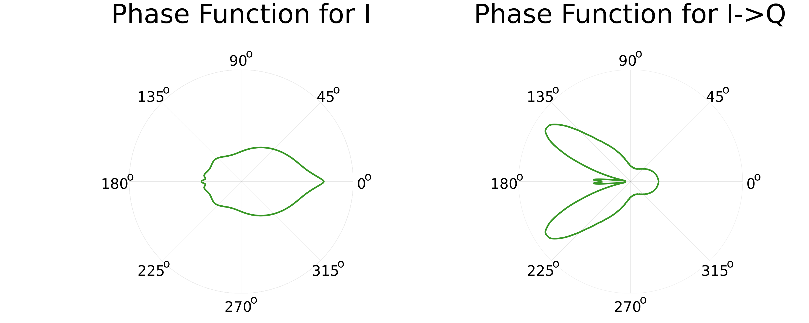
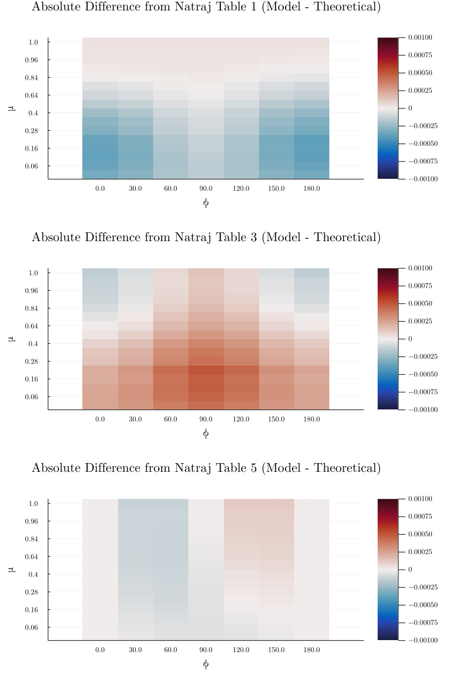

# Summary

Remote sensing researchers use satellite data and radiative transfer modeling to study Earth's atmospheric and surface properties. The field plays a key role in how scientists understand many aspects of our rapidly changing planet – from climate change and pollution to the carbon and water cycles.

**RadiativeTransfer.jl** is a [Julia](https://julialang.org) package that enables the fast computation of full-polarized radiative transfer simulations and atmospheric optical properties, based on the Matrix Operator Method (`@Sanghavi:2013`). Users can fully customize simulation parameters and atmospheric properties, including aerosol distributions, surface reflectance, and quadrature schemes. Independent submodules can also be imported individually; for example, **Absorption.jl** can be used for computing absorption cross-sections and **Scattering.jl** for computing scattering phase-functions. 

The Julia language provides many exciting opportunities to modernize radiative transfer software. Using the ForwardDiff.jl package (`@Revels:2016`), direct Jacobians can be calculated alongside computations using automatic differentiation, allowing for an elegant and straightforward parameter-fitting interface. Julia's multiple dispatch paradigm enables the software architecture to be clean, flexible and reusable. Additionally, optimized techniques have been implemented to speed up the package’s performance on both CPU and GPU by orders-of-magnitude compared to existing RT codes. 

**RadiativeTransfer.jl** has already been used in research projects, ranging from methane-plume simulation to atmospheric profile fitting. It has also been used in graduate-level remote sensing coursework. Ultimately, **RadiativeTransfer.jl** aims to accelerate the pace of atmospheric research through efficient software while lowering the barrier-of-entry for researchers and students in remote sensing. 

# Statement of need

For historical reasons, much of the scientific work in remote sensing is based on legacy code, written in Fortran or C/C++, mixed with “glue languages” such as Python. Researchers who developed these codes also placed greater emphasis on science results than software engineering best practices. As a result, many parts of key codebases are aging, convoluted, and hard to improve by both incoming graduate students and experienced researchers. 

Rather than simply *porting* these codes to a new language, **RadiativeTransfer.jl** entirely redesigns the radiative transfer code from the ground up to include new functionalities like GPU acceleration and automatic differentiation – features that have become computationally feasible and widespread only in the last decade. 

# Overview of functionality

The package has a modular architecture, allowing users to import just the specific module(s) that they need.

**RadiativeTransfer.jl** is the top-level module that uses absorption and scattering submodules to compute RT simulations. Specifically, it: 
- Enables 1D vectorized plane-parallel RT modeling based on the Matrix Operator Method (`@Sanghavi:2013`)
- Incorporates fast, high fidelity simulations of scattering atmospheres containing haze and clouds, including pressure- and temperature-resolved absorption profiles of gaseous species in the atmosphere
- Enables GPU-accelerated computations of the resulting hyperspectral reflectances/transmittances
- Enables auto-differentiation of the output spectrum with respect to various input parameters

**Absorption.jl** enables absorption cross-section calculations of atmospheric gases at different pressures, temperatures, wavelengths, and broadeners (Doppler, Lorentzian, Voigt). It uses the HITRAN (`@Gordon:2017`) energy transition database for calculations. While it enables lineshape calculations from scratch, the module also allows users to create and save an interpolator object at specified wavelength, pressure, and temperature grids. The module also supports auto-differentiation (AD) of the profile, with respect to pressure and temperature. Calculations can be computed either on CPU or GPU (CUDA).

**Scattering.jl** is used for calculating Mie scattering phase-functions for aerosols with specified size distributions and refractive indices. This module enables scattering phase-function calculation of atmospheric aerosols with different size distributions, incident wavelengths, and refractive indices. It can perform the calculation using either the Siewert NAI-2 or Domke PCW methods (`@Sanghavi:2017`). The module also supports auto-differentiation (AD) of the phase function, with respect to the aerosol's size distribution parameters and its refractive index. 

# Benchmarks

Standard reference tables from the literature are used to validate **RadiativeTransfer.jl** simulation output. 

This validation demonstrates that simulation output using RadiativeTransfer.jl closely matches the published standard values. 

Runtime duration for a given simulation is also compared between using CPU and GPU architectures. (CPU architecture is single-threaded, AMD EPYC 7H12 64-Core Processor; GPU is parallel on an NVIDIA A100 Tensor Core (40Gb))

# Acknowledgements

We thank Frankenberg lab members for their enthusiastic support and guidance throughout this project. We also acknowledge support from Caltech’s Schmidt Academy for Software Engineering.

# References

